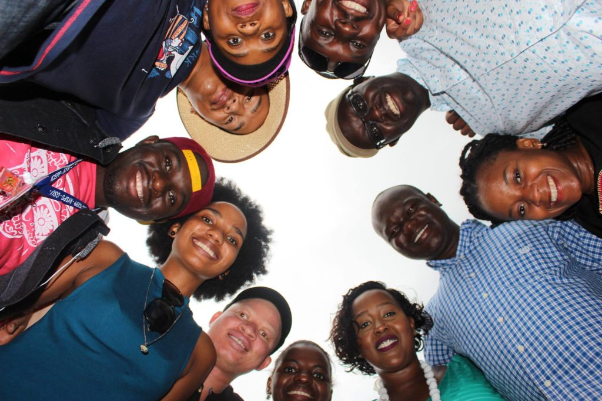
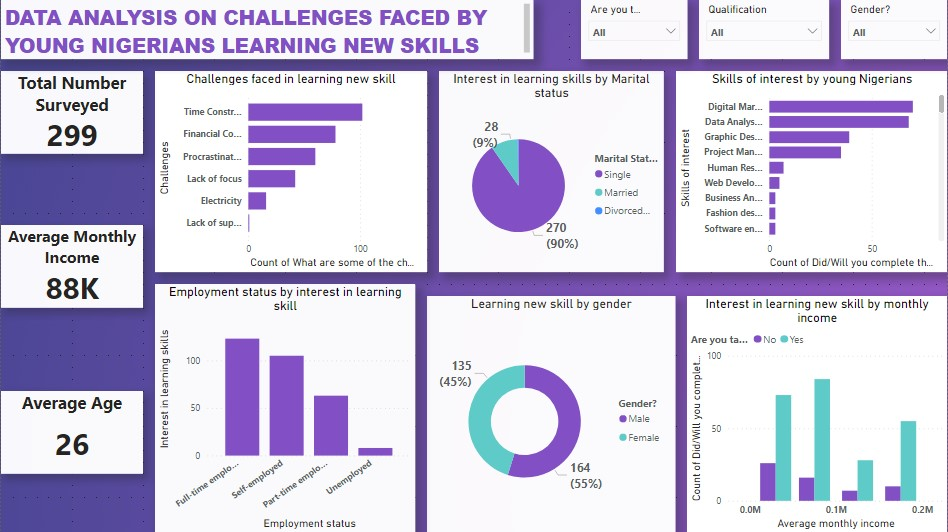

# DATA-ANALYSIS-ON-CHALLENGES-FACED-BY-YOUNG-NIGERIANS-LEARNING-NEW-SKILLS

## Introduction

Over the years, juggling and balancing work with learning has been one of the common challenges faced by young working Nigerians. In this project, I plan to address these challenges and proffer solutions to young professional Nigerians.

With the constant development of technology, there is a need amongst young professionals to constantly upskill and add to their existing knowledge so that they can remain viable options in the employment space. In Nigeria, there are many young working professionals who are taking courses alongside their main day-to-day job so they can have an edge over others in the already competitive job market. 

## Project Objectives 
1.	Identify the key challenges.
2.	Explore the strategies employed by young Nigerian professionals to overcome these challenges.
3.	Establish support systems needed to make balancing work and learning as a young Nigerian professional easier.
4.	Recommend ways to alleviate these problems.

## Data Source

Methodology: online questionnaire with a mix of open- and close-ended questions was used to collect the data. Survey questions  cover these thematic areas: demographics, education/career and skill learning/acquisition. Survey questions where piloted with a small group of individuals to ensure clarity and relevance of each question.
Participants: Working young Nigerians from different fields and educational backgrounds, aged 18 to 30 years old, who are studying or trying to learn a new skill.

## Project Questions
1.	What are the common challenges faced by young Nigerians who are working and learning a new skill?
2.	What is the most effective solution to helping young Nigerians balance work and learning new skills?
3.	How can these solutions be improved overtime?

## Data Analysis and Visualization

# Summary

1. Young Nigerians are displaying a significant interest in acquiring new skills, with 45% of females and 55% of males actively pursuing their educational endeavors.
2. The skills of interest among young Nigerians vary based on their employment status. Among full-time employees, 40% exhibit a strong desire to acquire new skills. Similarly, 35% of self-employed individuals actively seek to enhance their skill sets. Part-time employees also display a significant interest in skills, accounting for 20% of the group. Lastly, 5% of unemployed young Nigerians demonstrate an eagerness to acquire new skills despite their current job status. This distribution emphasizes that regardless of employment status, young Nigerians are driven to expand their knowledge and capabilities, recognizing the importance of continuous learning in today's dynamic job market.
3. Approximately 34% of respondents cited time constraints as a significant challenge. Balancing work, education, and other responsibilities makes it difficult to allocate sufficient time for learning new skills. 
4. Around 26% of respondents mentioned financial limitations as a hurdle. Limited financial resources hinder their ability to access quality learning resources, enroll in courses, or         participate in training programs. 
5. Roughly 20% of respondents struggle with procrastination. Delaying or postponing learning activities leads to slow progress and a lack of achievement in acquiring new skills. 
6. Approximately 14% of respondents struggle with maintaining focus and concentration on learning. Distractions from social media, personal commitments, and external factors make it         challenging to stay focused and make consistent progress. 
7. About 5% of respondents face difficulties due to frequent power outages and unreliable electricity supply. Access to stable electricity is crucial for online learning, utilizing           digital resources, and practicing new skills effectively.

## Solutions/Recommendations

To address these challenges, the over 300 young Nigerians surveyed gave various strategies and recommendation on how to overcome these challenges which are listed below:

  ❖	Prioritize and manage time effectively by setting clear goals, creating a study schedule, and eliminating unnecessary distractions.

  ❖	Seek out free or low-cost resources available online, such as educational websites, tutorials, or open-source learning platforms.

  ❖	Explore scholarships, grants, or funding opportunities to alleviate financial constraints.

  ❖	Join communities or support groups focused on skill acquisition to find like-minded individuals and receive encouragement and guidance.

  ❖	Utilize alternative power sources, such as generators, inverter or solar panels, to mitigate the impact of unreliable electricity.

  ❖	Communicate their passion and goals to their family and friends, explaining the importance of skill acquisition and seeking their support.
  
  ## Limitation
  	●	Data collection was done within 5days which limited the number of people surveyed
    
    ●	The Age range was between 20 to 30years of age
    
